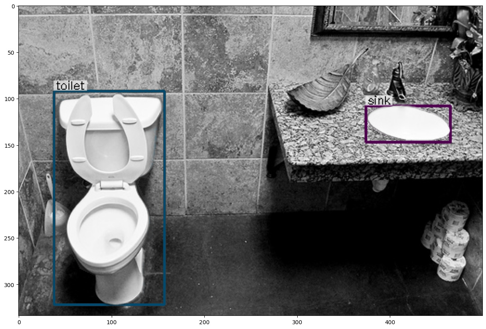

# BoxeR

This repository is a fork from [BoxeR](https://github.com/kienduynguyen/BoxeR). Please check the original repository for more information on the mechanism. 

BoxeR is proposed by [Duy-Kien Nguyen](https://scholar.google.com/citations?user=welhhBIAAAAJ&hl=en), Jihong Ju, Olaf Booij, [Martin R. Oswald](https://scholar.google.de/citations?user=biytQP8AAAAJ&hl=en), [Cees Snoek](https://www.ceessnoek.info/).

This repository is an implementation of the paper [BoxeR: Box-Attention for 2D and 3D Transformers](https://arxiv.org/abs/2111.13087).

## Introduction

We are very interested in the BoxeR attention proposed from the paper thus we decided to use this paper as our final project topic for COSC-5470. However, since the code for BoxeR was published in 2022, 2 years ago from now, a lot of the dependencies are out-of-date and several functions of some libraries have already deprecated. As a result, we create this repository to record the changes we made to the original codebase. 

## Changes

Below are the changes we made to the original code so that the program can still operate today as intended.

### Python Version
In the original installation, the authors suggested to create a conda environment of Python version 3.8. However, this is outdated since some of the newest dependencies stopped supporting this version. Thus, we have used Python version 3.10.14 for our project. 

### Setup.py
The original authors used setup.py to initialize the end-to-end project, but some of the required libraries are outdated. In particular,  ```waymo-open-dataset-tf-2-6-0``` is causing a lot of errors due to incompatibility with the newest TensorFlow (2.12.0). As a result, we have changed to install ```waymo-open-dataset-tf-2-12-0``` version 1.6.4 and it resolves all the incompatibility issues. 

In fact, we recommend to mannually install ```waymo-open-dataset-tf-2-12-0``` first even before running setup.py because ```pip``` will automically install all the dependencies needed for waymo dataset with the correct versions. This will help a smoother setup experience. 

### ```torch._six```

Dependency on Python 2 and 3 compatibility library ```six``` has been removed according to [this](https://github.com/pytorch/pytorch/pull/94709) commit on PyTorch. However, some of the helper files in BoxeR still uses the ```six``` library. Setting ```string_classes = str``` will resolve this issue.

### ```collections.Mapping```

```collections.Mapping``` is deprecated. Add ```from collections.abc import Mapping``` and use ```mapping``` instead. 

### Installed Packages
Below is a list of installed packages from running ```pip list``` on my conda environment:
```
Package                      Version            
---------------------------- ------------------
absl-py                      1.4.0
antlr4-python3-runtime       4.9.3
array_record                 0.5.1
asttokens                    2.4.1
astunparse                   1.6.3
black                        24.4.0
cachetools                   5.3.3
certifi                      2024.2.2
charset-normalizer           3.3.2
click                        8.1.7
cloudpickle                  3.0.0
comm                         0.2.2
contourpy                    1.2.1
cycler                       0.12.1
Cython                       0.29.30
dacite                       1.8.1
dask                         2023.3.1
dataclass_array              1.5.1
debugpy                      1.6.7
decorator                    5.1.1
detectron2                   0.6                
dm-tree                      0.1.8
e2edet                       0.1                
einops                       0.7.0
einsum                       0.3.0
etils                        1.7.0
exceptiongroup               1.2.0
executing                    2.0.1
filelock                     3.13.4
flatbuffers                  24.3.25
fonttools                    4.51.0
fsspec                       2024.3.1
fvcore                       0.1.5.post20221221
gast                         0.4.0
google-auth                  2.16.2
google-auth-oauthlib         1.0.0
google-pasta                 0.2.0
googleapis-common-protos     1.63.0
grpcio                       1.62.1
h5py                         3.11.0
hydra-core                   1.3.2
idna                         3.7
imageio                      2.34.0
immutabledict                2.2.0
importlib_metadata           7.1.0
importlib_resources          6.4.0
iopath                       0.1.9
ipykernel                    6.29.3
ipython                      8.22.2
jax                          0.4.26
jedi                         0.19.1
Jinja2                       3.1.3
joblib                       1.4.0
jupyter_client               8.6.1
jupyter_core                 5.7.2
keras                        2.12.0
kiwisolver                   1.4.5
lark                         1.1.9
lazy_loader                  0.4
libclang                     18.1.1
llvmlite                     0.42.0
locket                       1.0.0
Markdown                     3.6
markdown-it-py               3.0.0
MarkupSafe                   2.1.5
matplotlib                   3.6.1
matplotlib-inline            0.1.7
mdurl                        0.1.2
ml-dtypes                    0.3.2
mpmath                       1.3.0
munkres                      1.1.4
mypy-extensions              1.0.0
namex                        0.0.8
nest_asyncio                 1.6.0
networkx                     3.3
numba                        0.59.1
numpy                        1.23.0
nvidia-cublas-cu12           12.3.4.1
nvidia-cuda-cupti-cu12       12.3.101
nvidia-cuda-nvcc-cu12        12.3.107
nvidia-cuda-nvrtc-cu12       12.3.107
nvidia-cuda-runtime-cu12     12.3.101
nvidia-cudnn-cu12            8.9.7.29
nvidia-cufft-cu12            11.0.12.1
nvidia-curand-cu12           10.3.4.107
nvidia-cusolver-cu12         11.5.4.101
nvidia-cusparse-cu12         12.2.0.103
nvidia-nccl-cu12             2.19.3
nvidia-nvjitlink-cu12        12.3.101
nvidia-nvtx-cu12             12.1.105
oauthlib                     3.2.2
omegaconf                    2.3.0
opencv-python                4.9.0.80
OpenEXR                      1.3.9
opt-einsum                   3.3.0
optree                       0.11.0
packaging                    24.0
pandas                       1.5.3
parso                        0.8.4
partd                        1.4.1
pathspec                     0.12.1
pexpect                      4.9.0
pickleshare                  0.7.5
Pillow                       9.2.0
pip                          23.3.1
platformdirs                 4.2.0
plotly                       5.13.1
portalocker                  2.8.2
promise                      2.3
prompt-toolkit               3.0.42
protobuf                     3.20.3
psutil                       5.9.8
ptyprocess                   0.7.0
pure-eval                    0.2.2
pyarrow                      10.0.0
pyasn1                       0.6.0
pyasn1_modules               0.4.0
pycocotools                  2.0.7
Pygments                     2.17.2
pyparsing                    3.1.2
python-dateutil              2.9.0
PyWavelets                   1.6.0
PyYAML                       6.0.1
pyzmq                        25.1.2
requests                     2.31.0
requests-oauthlib            2.0.0
rich                         13.7.1
rsa                          4.9
scikit-image                 0.20.0
scikit-learn                 1.2.2
scipy                        1.13.0
setuptools                   67.6.0
six                          1.16.0
stack-data                   0.6.2
sympy                        1.12
tabulate                     0.9.0
tenacity                     8.2.3
tensorboard                  2.12.3
tensorboard-data-server      0.7.2
tensorflow                   2.12.0
tensorflow-addons            0.23.0
tensorflow-datasets          4.9.4
tensorflow-estimator         2.12.0
tensorflow-graphics          2021.12.3
tensorflow-io-gcs-filesystem 0.36.0
tensorflow-metadata          1.14.0
tensorflow-probability       0.19.0
termcolor                    2.4.0
threadpoolctl                3.4.0
tifffile                     2024.2.12
toml                         0.10.2
tomli                        2.0.1
toolz                        0.12.1
torch                        2.2.2
torchaudio                   2.2.2
torchvision                  0.17.2
tornado                      6.4
tqdm                         4.66.2
traitlets                    5.14.2
trimesh                      4.3.1
triton                       2.2.0
typeguard                    2.13.3
typing_extensions            4.11.0
unicodedata2                 15.1.0
urllib3                      2.2.1
visu3d                       1.5.1
waymo-open-dataset-tf-2-12-0 1.6.4
wcwidth                      0.2.13
Werkzeug                     3.0.2
wheel                        0.41.2
wrapt                        1.14.1
yacs                         0.1.8
zipp                         3.17.0
```

## Results
Result generated from the BoxeR-2D model trained only on object detection:


